# Домашнее задание к занятию "`Git`" - `Митяев Григорий`


### Инструкция по выполнению домашнего задания

   1. Сделайте `fork` данного репозитория к себе в Github и переименуйте его по названию или номеру занятия, например, https://github.com/имя-вашего-репозитория/git-hw или  https://github.com/имя-вашего-репозитория/7-1-ansible-hw).
   2. Выполните клонирование данного репозитория к себе на ПК с помощью команды `git clone`.
   3. Выполните домашнее задание и заполните у себя локально этот файл README.md:
      - впишите вверху название занятия и вашу фамилию и имя
      - в каждом задании добавьте решение в требуемом виде (текст/код/скриншоты/ссылка)
      - для корректного добавления скриншотов воспользуйтесь [инструкцией "Как вставить скриншот в шаблон с решением](https://github.com/netology-code/sys-pattern-homework/blob/main/screen-instruction.md)
      - при оформлении используйте возможности языка разметки md (коротко об этом можно посмотреть в [инструкции  по MarkDown](https://github.com/netology-code/sys-pattern-homework/blob/main/md-instruction.md))
   4. После завершения работы над домашним заданием сделайте коммит (`git commit -m "comment"`) и отправьте его на Github (`git push origin`);
   5. Для проверки домашнего задания преподавателем в личном кабинете прикрепите и отправьте ссылку на решение в виде md-файла в вашем Github.
   6. Любые вопросы по выполнению заданий спрашивайте в чате учебной группы и/или в разделе “Вопросы по заданию” в личном кабинете.
   
Желаем успехов в выполнении домашнего задания!
   
### Дополнительные материалы, которые могут быть полезны для выполнения задания

1. [Руководство по оформлению Markdown файлов](https://gist.github.com/Jekins/2bf2d0638163f1294637#Code)

---

### Задание 1

1. Зарегистрировал аккаунт на **github.com**
2. Создал новый репозиторий **assignment** c файлом **README.md**
3. Склонировал репозиторий **assignment** к себе на локальную ВМ
4. Перешел в каталог с клоном репозитория assignment
5. Произвел первоначальную настройку Git с указанием моих ФИ и адреса эл.почты
6. Выполнил команду git status
7. Отредактировал файл **README.md**, добавив **шаг 1**
8. Cтатус файла изменился на **modified**, добавил строки **шаг 2**, **шаг 3**,**шаг 4**
9. Просмотр изменений с помощью команды **git diff** и **get diff --staged**
10. Добавляем файл **README.md** из репозитория **assignment** в коммит командой **git add README.md**
11. Снова выполняем команды **git diff** и **git diff --staged**
12. Создаем коммит с комментарием **git commit -m "first commit"**
13. Пушим внесенные изменения в глобальный репозиторий **assignment** в ветку main на **Github**. 

#### Ссылка на коммит [**assignment**](https://github.com/mityaevg/assignment.git) 

```
mityaevg@debian-11:~/8-03-hw$ git clone https://github.com/mityaevg/assignment1.git
mityaevg@debian-11:~/8-03-hw$ cd assignment1
mityaevg@debian-11:~/8-03-hw/assignment1$ ls -la
mityaevg@debian-11:~/8-03-hw/assignment1$ git config --global user.name "Grigoriy Mityaev"
mityaevg@debian-11:~/8-03-hw/assignment1$ git config --global user.email gmitiaev@yandex.ru
mityaevg@debian-11:~/8-03-hw/assignment1$ git status
mityaevg@debian-11:~/8-03-hw/assignment1$ git diff
mityaevg@debian-11:~/8-03-hw/assignment1$ git diff --staged
mityaevg@debian-11:~/8-03-hw/assignment1$ git add README.md
mityaevg@debian-11:~/8-03-hw/assignment1$ git diff
mityaevg@debian-11:~/8-03-hw/assignment1$ git diff --staged
mityaevg@debian-11:~/8-03-hw/assignment1$ git commit -m "first commit"
mityaevg@debian-11:~/8-03-hw/assignment1$ git push origin main

```

<kbd>`</kbd>

<kbd></kbd>

<kbd></kbd>

<kbd></kbd>

<kbd></kbd>

<kbd></kbd>

<kbd></kbd>

<kbd></kbd>

<kbd></kbd>

<kbd></kbd>

<kbd>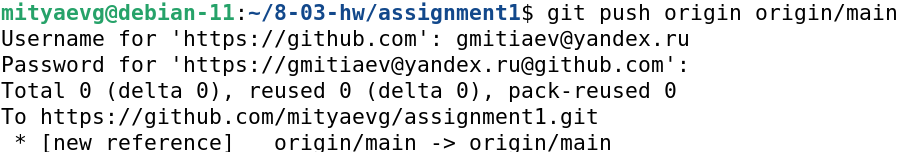

---

### Задание 2

1. Создал файл **.gitignore** и проверил его статус сразу после создания.
2. Добавим **.gitignore** 
3. Пропишем игнорирование файлов с расширением **.pyc** и всех файлов в директории **cache**
4. Создадим коммит и сделаем пуш в глобальный репозиторий.

```
mityaevg@debian-11:~/8-03-hw/assignment$ touch .gitignore
mityaevg@debian-11:~/8-03-hw/assignment$ git status
mityaevg@debian-11:~/8-03-hw/assignment$ git commit -a -m ".gitignore created and set to ignore .pyc file and contents of cache folder"
mityaevg@debian-11:~/8-03-hw/assignment$ git push origin main

```

<kbd>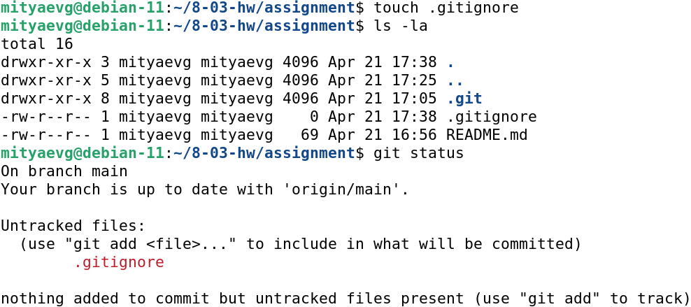</kbd>

<kbd>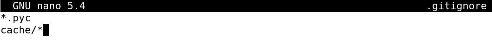</kbd>

<kbd>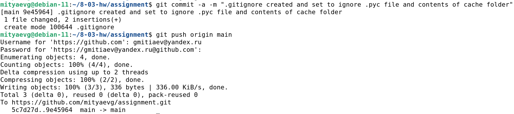

#### Ссылка на коммит [**assignment**](https://github.com/mityaevg/assignment.git)

---

### Задание 3

1. Создадим новую ветку **test** в репозитории assignment и сразу переключимся на нее.
2. Создал файл **test.sh** c тестовым наполнением.
3. Добавил еще несколько строк в **test.sh**. Создал коммит после добавления каждой строки и сделал пуш 
   каждого коммита в глобальный репозиторий **assigment** в ветку **test**.
4. Переключимся обратно на ветку **main**. Производим слияние веток **main** и **test**.
5. Создаем коммит и пушим изменения в ветку **main** глобального репозитория **assignment**. 

#### Ссылка на graph коммитов [**assignment**](https://github.com/mityaevg/assignment/network)

```
mityaevg@debian-11:~/8-03-hw/assignment$ git checkout -b test
mityaevg@debian-11:~/8-03-hw/assignment$ git commit -a -m "test.sh, commit1"
mityaevg@debian-11:~/8-03-hw/assignment$ git commit -a -m "test.sh, commit2"
mityaevg@debian-11:~/8-03-hw/assignment$ git commit -a -m "test.sh, commit3"
mityaevg@debian-11:~/8-03-hw/assignment$ git checkout main
mityaevg@debian-11:~/8-03-hw/assignment$ git merge test
mityaevg@debian-11:~/8-03-hw/assignment$ git commit -a -m "test.sh, all commits merged and pushed to origin main"
mityaevg@debian-11:~/8-03-hw/assignment$ git push origin main

```

<kbd>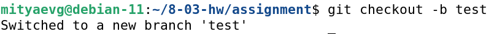</kbd>

<kbd>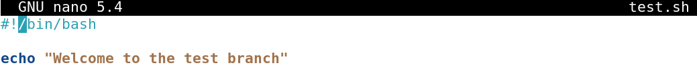</kbd>

<kbd>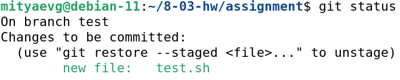</kbd>

<kbd>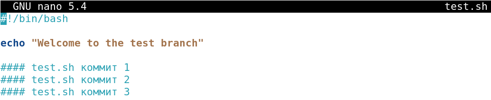</kbd>

<kbd>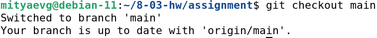</kbd>

<kbd>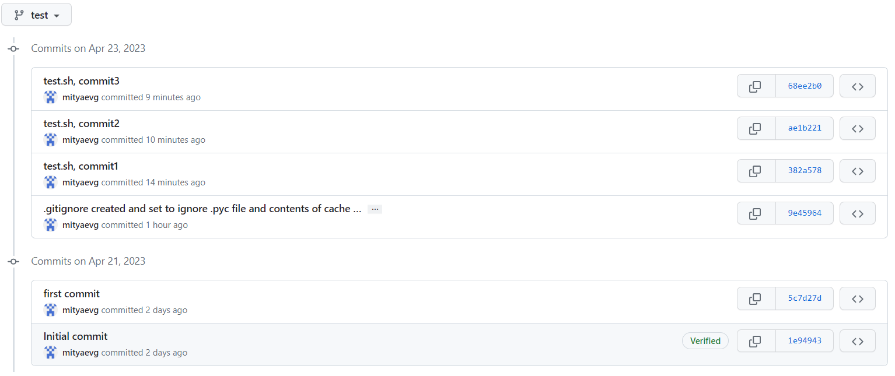</kbd>

<kbd>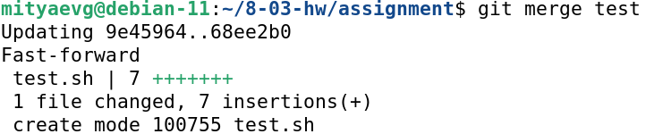</kbd>
