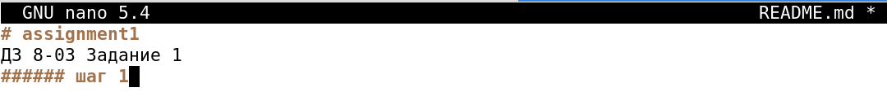

# Домашнее задание к занятию "`Git`" - `Митяев Григорий`


### Инструкция по выполнению домашнего задания

   1. Сделайте `fork` данного репозитория к себе в Github и переименуйте его по названию или номеру занятия, например, https://github.com/имя-вашего-репозитория/git-hw или  https://github.com/имя-вашего-репозитория/7-1-ansible-hw).
   2. Выполните клонирование данного репозитория к себе на ПК с помощью команды `git clone`.
   3. Выполните домашнее задание и заполните у себя локально этот файл README.md:
      - впишите вверху название занятия и вашу фамилию и имя
      - в каждом задании добавьте решение в требуемом виде (текст/код/скриншоты/ссылка)
      - для корректного добавления скриншотов воспользуйтесь [инструкцией "Как вставить скриншот в шаблон с решением](https://github.com/netology-code/sys-pattern-homework/blob/main/screen-instruction.md)
      - при оформлении используйте возможности языка разметки md (коротко об этом можно посмотреть в [инструкции  по MarkDown](https://github.com/netology-code/sys-pattern-homework/blob/main/md-instruction.md))
   4. После завершения работы над домашним заданием сделайте коммит (`git commit -m "comment"`) и отправьте его на Github (`git push origin`);
   5. Для проверки домашнего задания преподавателем в личном кабинете прикрепите и отправьте ссылку на решение в виде md-файла в вашем Github.
   6. Любые вопросы по выполнению заданий спрашивайте в чате учебной группы и/или в разделе “Вопросы по заданию” в личном кабинете.
   
Желаем успехов в выполнении домашнего задания!
   
### Дополнительные материалы, которые могут быть полезны для выполнения задания

1. [Руководство по оформлению Markdown файлов](https://gist.github.com/Jekins/2bf2d0638163f1294637#Code)

---

### Задание 1

1. Зарегистрировал аккаунт на github.com
2. Создал новый репозиторий assignment1 c файлом README.md
3. Склонировал репозиторий assignment1 к себе на локальную ВМ
4. Перешел в каталог с клоном репозитория assignment1
5. Произвел первоначальную настройку Git с указанием моих ФИ и адреса эл.почты
6. Выполнил команду git status
7. Отредактировал файл README.md, добавив шаг 1
8. Cтатус файла изменился на **modified**, добавил строки шаг 2, шаг 3, шаг 4
9. Просмотр изменений с помощью команды git diff и get diff --staged
10. Добавляем файл README.md из репозитория assignment1 в коммит командой git add README.md
11. Снова выполняем команды git diff и git diff --staged
12. Делаем коммит git commit -m "first commit"
13. Пушим внесенные изменения в глобальный репозиторий assignment1 в ветку main на Github. 

#### Ссылка на коммит [**assignment1**](https://github.com/mityaevg/assignment1.git) 

```
mityaevg@debian-11:~/8-03-hw$ git clone https://github.com/mityaevg/assignment1.git
mityaevg@debian-11:~/8-03-hw$ cd assignment1
mityaevg@debian-11:~/8-03-hw/assignment1$ ls -la
mityaevg@debian-11:~/8-03-hw/assignment1$ git config --global user.name "Grigoriy Mityaev"
mityaevg@debian-11:~/8-03-hw/assignment1$ git config --global user.email gmitiaev@yandex.ru
mityaevg@debian-11:~/8-03-hw/assignment1$ git status
mityaevg@debian-11:~/8-03-hw/assignment1$ git diff
mityaevg@debian-11:~/8-03-hw/assignment1$ git diff --staged
mityaevg@debian-11:~/8-03-hw/assignment1$ git add README.md
mityaevg@debian-11:~/8-03-hw/assignment1$ git diff
mityaevg@debian-11:~/8-03-hw/assignment1$ git diff --staged
mityaevg@debian-11:~/8-03-hw/assignment1$ git commit -m "first commit"
mityaevg@debian-11:~/8-03-hw/assignment1$ git push origin origin/main

```
`





`
---

### Задание 2

`Приведите ответ в свободной форме........`

1. `Заполните здесь этапы выполнения, если требуется ....`
2. `Заполните здесь этапы выполнения, если требуется ....`
3. `Заполните здесь этапы выполнения, если требуется ....`
4. `Заполните здесь этапы выполнения, если требуется ....`
5. `Заполните здесь этапы выполнения, если требуется ....`
6. 

```
Поле для вставки кода...
....
....
....
....
```

`При необходимости прикрепитe сюда скриншоты
`


---

### Задание 3

`Приведите ответ в свободной форме........`

1. `Заполните здесь этапы выполнения, если требуется ....`
2. `Заполните здесь этапы выполнения, если требуется ....`
3. `Заполните здесь этапы выполнения, если требуется ....`
4. `Заполните здесь этапы выполнения, если требуется ....`
5. `Заполните здесь этапы выполнения, если требуется ....`
6. 

```
Поле для вставки кода...
....
....
....
....
```

`При необходимости прикрепитe сюда скриншоты
`

### Задание 4

`Приведите ответ в свободной форме........`

1. `Заполните здесь этапы выполнения, если требуется ....`
2. `Заполните здесь этапы выполнения, если требуется ....`
3. `Заполните здесь этапы выполнения, если требуется ....`
4. `Заполните здесь этапы выполнения, если требуется ....`
5. `Заполните здесь этапы выполнения, если требуется ....`
6. 

```
Поле для вставки кода...
....
....
....
....
```

`При необходимости прикрепитe сюда скриншоты
`

---
## Дополнительные задания (со звездочкой*)

Эти задания дополнительные (не обязательные к выполнению) и никак не повлияют на получение вами зачета по этому домашнему заданию. Вы можете их выполнить, если хотите глубже и/или шире разобраться в материале.

### Задание 5

`Приведите ответ в свободной форме........`

1. `Заполните здесь этапы выполнения, если требуется ....`
2. `Заполните здесь этапы выполнения, если требуется ....`
3. `Заполните здесь этапы выполнения, если требуется ....`
4. `Заполните здесь этапы выполнения, если требуется ....`
5. `Заполните здесь этапы выполнения, если требуется ....`
6. 

`При необходимости прикрепитe сюда скриншоты
`
